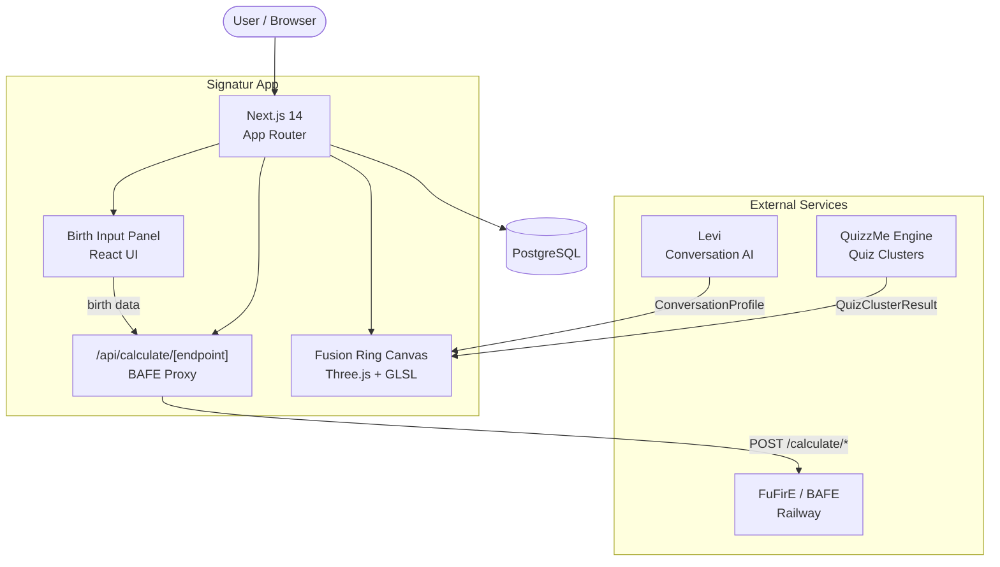
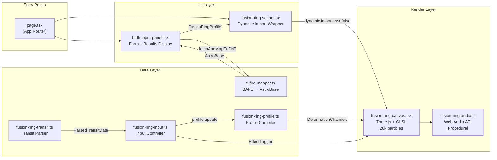
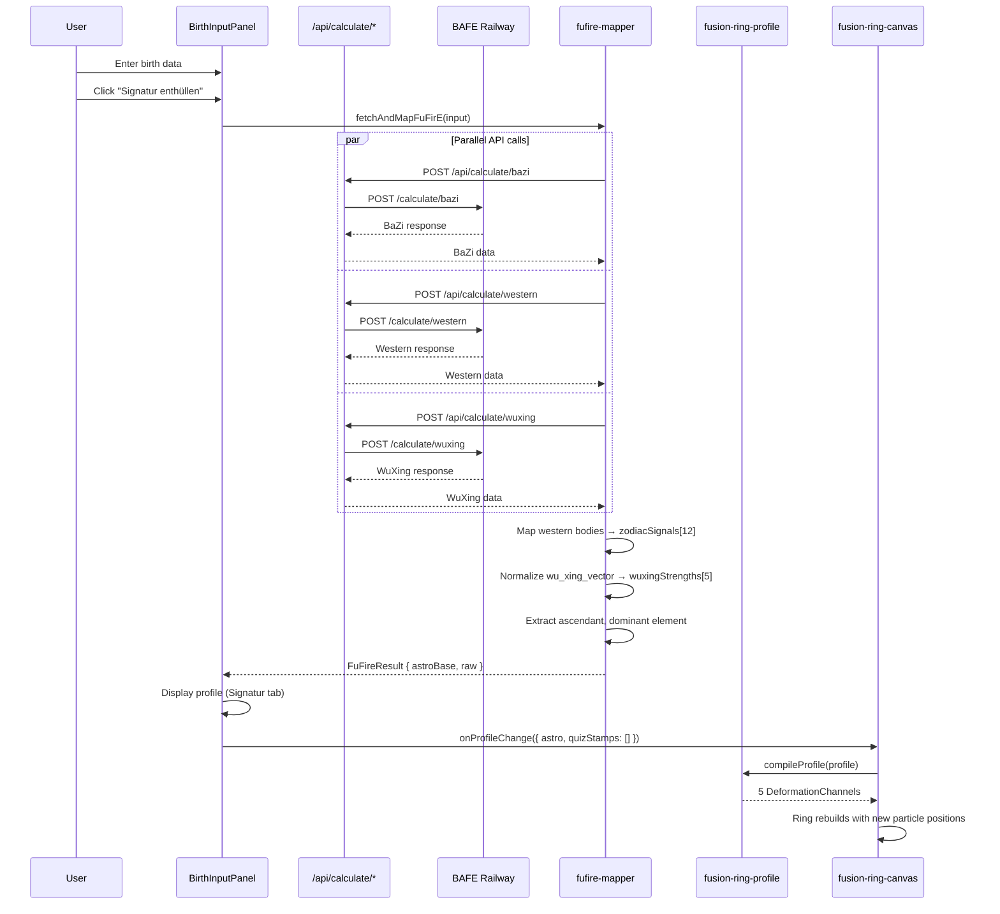
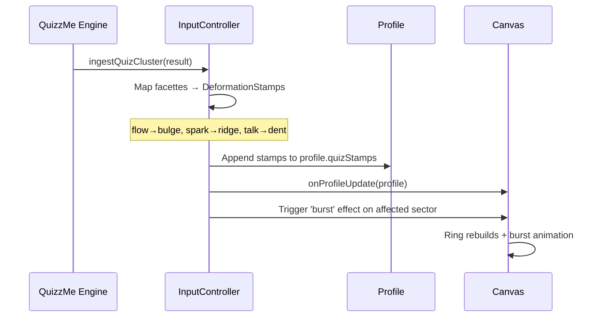
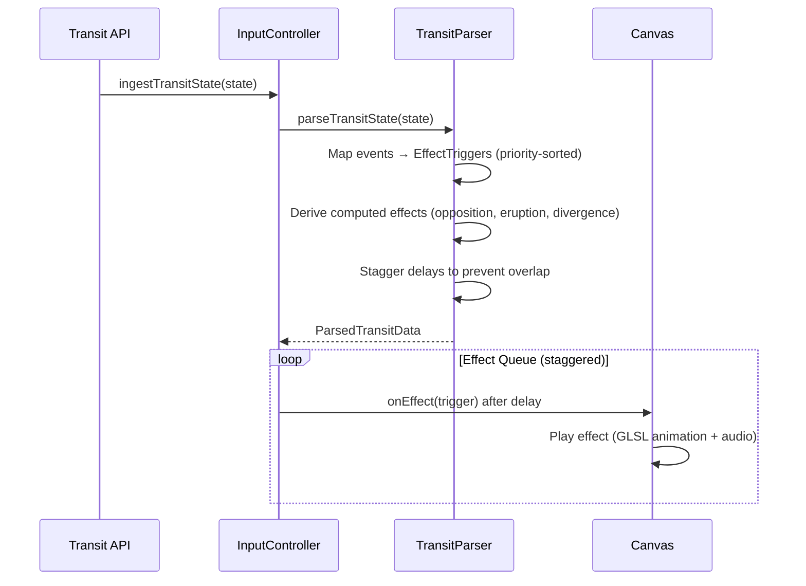

# Signatur Architecture

## System Context

## Component Architecture

## Data Flow: Birth Input to Ring

## Data Flow: Quiz Completion

## Data Flow: Transit State

## Module Responsibilities

### fusion-ring-profile.ts — The Brain

Defines the ring's permanent shape from two additive layers:

1. **AstroBase** (immutable): zodiac signals, Wu Xing strengths, BaZi roughness
2. **QuizStamps** (accumulating): deformation stamps from completed quizzes + Levi sessions

`compileProfile()` compiles both into 5 continuous functions that the renderer samples per-particle:

| Channel | Input Sources | Output |
|---------|--------------|--------|
| radiusOffset | zodiac signals, ascendant, bulge/dent/ridge/groove stamps | Hills and valleys in the ring |
| tubeScale | dominant element, thickening/thinning stamps | Ring tube thickness |
| roughness | BaZi roughness, zodiac signals, tension stamps | Surface texture scatter |
| colorTint | Wu Xing element colors, stamp color overrides | Sector coloring |
| coronaFactor | zodiac signals, bulge/ridge stamps | Corona strand height |

### fusion-ring-canvas.tsx — The Renderer

2000+ line Three.js renderer with:
- Custom vertex/fragment GLSL shaders for particles
- 28k ring particles + 3k corona particles + 500 dust particles
- ACES Filmic tone mapping, exposure 1.8, fog at 16-40 distance
- 8 effect animations with per-particle displacement
- Debug UI panel with effect buttons and profile controls
- `updateProfile()` triggers ring geometry rebuild via `window.__fusionRingRebuild`

### fusion-ring-input.ts — The Controller

Unified input manager for all 3 data channels:

| Channel | Weight | Source | Persistence |
|---------|--------|--------|-------------|
| A: Transit | T=0.18 | TRANSIT_STATE_v1 JSON | Temporary (session) |
| B: Quiz | via stamps | QuizClusterResult | Permanent (accumulating) |
| C: Conversation | C=0.10 | Levi ConversationProfile | Semi-permanent (bucket) |

Manages effect queue with proper staggering (4s between events, re-stagger on overlap).

### fusion-ring-transit.ts — The Transit Parser

Parses TRANSIT_STATE_v1 into:
- Explicit effects from `events[]` (resonance_jump, dominance_shift, moon_event)
- Derived effects from patterns:
  - **spannungsachse**: sector opposition > 0.4
  - **korona_eruption**: transit intensity > 0.7
  - **divergenz_spike**: rising trend + delta > 0.3
  - **burst**: 4+ sectors > 0.6
  - **crunch**: falling trend + intensity < 0.3

### fusion-ring-audio.ts — The Sound

Procedural Web Audio API (no audio files):
- Sub-bass drone: 3 oscillators at 32Hz, 48Hz, 24Hz
- LFO modulation for breathing rhythm
- Thunder peaks triggered by effects
- Lazy AudioContext init (requires user gesture)

## Environment Variables

| Variable | Purpose | Default |
|----------|---------|---------|
| `BAFE_BASE_URL` | FuFirE API upstream | `https://bafe-production.up.railway.app` |
| `DATABASE_URL` | PostgreSQL connection string | Required for Prisma |
| `NEXTAUTH_URL` | Base URL for metadata | `http://localhost:3000` |
